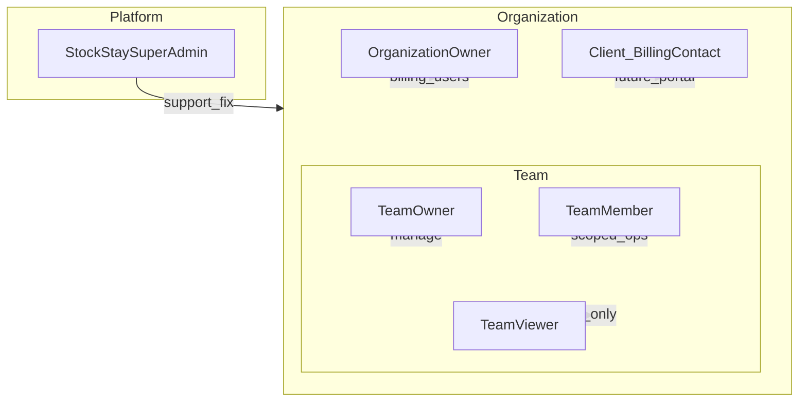
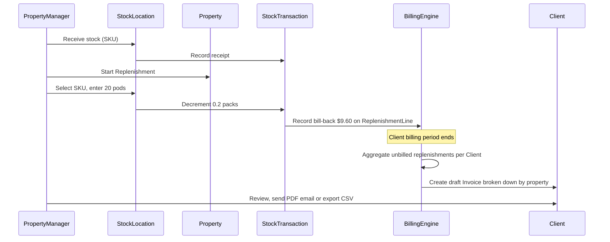
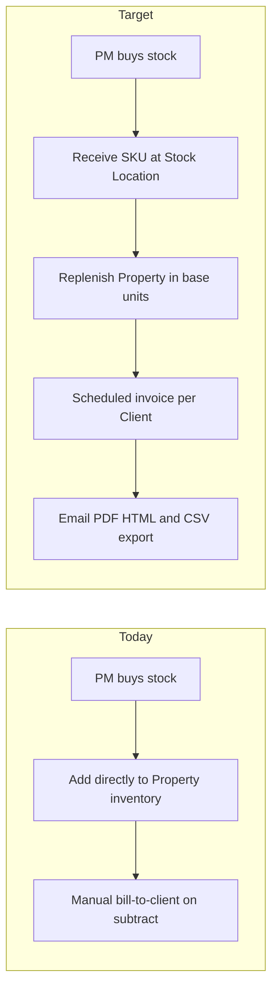

# Stock Stay — Requirements & Domain Specification

**Version:** 1.8 (PITR runbook + Vite/Prisma within-major hygiene)  
**Status:** Ready for implementation planning  
**Audience:** David (product owner), development agents, QA  
**Last updated:** 2026-08-03

---

## Document purpose

This document is the **source of truth** for Stock Stay's functional requirements. It synthesizes:

1. The **current codebase** (`server/prisma/schema.prisma`, `server/server.js`, frontend pages)
2. The **Phase 1 assessment** (Probable, February 2026)
3. **Product strategy call notes** (stock locations, supply catalogue, monthly client billing)
4. **Validation sessions** with Neil (Probable) and David

Future implementation work — schema changes, API refactors, UI flows — should trace back to sections in this document. Validated decisions are recorded in [Section 11](#11-resolved-decisions).

---

## 1. Product overview

### 1.1 What Stock Stay is

Stock Stay is an **inventory management tool for short-term rental (STR) property managers**. Property managers purchase consumables centrally (cleaning supplies, coffee pods, toiletries, etc.), hold that stock at a **stock location**, and **replenish properties** as needed. When stock moves from a stock location to a property, the PM **bills the client** associated with that property.

The core value proposition:

- Track what the PM has on hand at central supply locations
- Alert when a **supply item** is low at a stock location (not per brand/pack SKU)
- Automatically calculate **client bill-back** when stock is deployed to a property
- Generate **scheduled invoices** for clients and export them for accounting software

### 1.2 Two billing layers (keep distinct)

Stock Stay has two completely separate billing concepts. Documentation, code, and UI must never conflate them.

| Layer | Who pays whom | Mechanism | Status |
|-------|---------------|-----------|--------|
| **SaaS billing** | PM company → Stock Stay | Stripe subscription (Free / Starter / Pro) | Existing; largely unchanged |
| **Client billing** | PM company → Client | Scheduled invoices for replenished stock | Major redesign; simple in v1 |

**Client billing (v1 scope):**

- PM generates draft invoices from accumulated replenishments on each client's billing schedule
- PM reviews, sends by **email (HTML + PDF attachment)**, or **exports CSV**
- PM marks invoices paid/overdue **manually**
- **No** in-app payment collection, **no** client login portal in v1
- **No** ad-hoc invoice at replenishment time (deferred — UX complexity)

### 1.3 Confirmed product decisions

| Topic | Decision |
|-------|----------|
| Client ↔ Property | One client can be billed for **multiple properties**. Each property has **one billing client**. |
| Client identity | **Client** is a billing contact — not assumed to be the property owner. The PM's relationship may be with an owner, manager, or other party. |
| Billing schedule | Per client: **weekly**, **biweekly**, or **monthly (end of month)**. Editable per client. Period boundaries use **`Team.billingTimezone`** (IANA, editable in Settings) — Q1b resolved. |
| Bill-back pricing | Unit rate × base qty, plus **markup**. Markup is set **per property**, with a **default markup per client**. |
| Invoice grouping | **One invoice per client** per billing period, with line items **broken down by property**. |
| Ad-hoc invoice at replenishment | **Out of scope** for now. |
| Replenishment reversals | Credit applied on the **next invoice** for that client (no separate credit-note document). |
| Inter-property transfer | Always **pass through a stock location**. Each leg is a normal billable/refundable transaction: Property→Location **credits** the source property's client; Location→Property **bills** the destination property's client. |
| Multi-team users | **Schema and UI in v1** (UserMembership + team switching) so the feature can be tested end-to-end. |
| Negative stock | **Hard block** — replenishment (and other outflows) must not leave StockOnHand negative. |
| Data migration | **None.** Service has not launched; replace existing models as needed. |
| Stock location fields | **Name + address + tags** are sufficient. |
| Plan limits | Caps for stock locations, supply items, SKUs (and properties/users/inventory). Values in `plan-limits.json`; UI/marketing read live via `GET /api/plans`. |
| Invoice delivery | **PDF**, **email HTML**, and **CSV export** are all required in v1. Accounting export = CSV only (QBO/Xero-specific formats deferred). |
| Consumption tracking | **Not in v1**. Billing is driven by stock location ↔ property movements (replenish and return), including legs of inter-property transfers. Properties are **billing destinations**, not inventory monitors — no property on-hand balance or property-level low-stock. |
| Break-pack | Replenishment can deploy **partial units** from a sealed SKU (e.g. 20 loose pods from a 100-pack → decrement 0.2 packs at stock location). |
| Location low stock | Per **Supply Item × Stock Location** via `LocationSupplyThreshold` (base units). On-hand for the alert = sum of `StockOnHand.quantity × Sku.packSize` across that item’s SKUs at the location. |
| v1 scope | Include **Organization** model above Team. Client portal, payment gateway, consumption, and ad-hoc replenishment invoicing = deferred. |

---

## 2. Domain terminology

### 2.1 Recommended terms

| Schema name | UI label | Definition |
|-------------|----------|------------|
| **SupplyItem** | Supply Item | Canonical product the PM tracks ("Coffee Pod"). Quantity at properties is expressed in the item's **base unit** (e.g. pods, ml, g). |
| **SKU** | SKU | A specific purchasable package linked to a Supply Item (e.g. "Kirkland Pacific Bold — Pack of 100 @ $48"). Team-shared catalogue row; holds pack size and default purchase price / **unit rate**. Quantity lives on StockOnHand per location. |
| **StockLocation** | Stock Location | PM's central supply shelf/warehouse. Holds SKU inventory before replenishment. UI alias: "Central Supply". |
| **Replenishment** | Replenishment | Moving stock from a Stock Location to a Property. **Chargeable event** for client bill-back. Avoid "sale" or "allocation" in UI. |
| **Client** | Client | Billing contact for a property. Not assumed to be the property owner. One client may be billed for multiple properties. |
| **Organization** | Organization | Top-level tenant; Stock Stay subscription billing. |
| **Team** | Team | Operational unit within an organization. |
| **Property** | Property | STR rental unit. |
| **StockTransaction** | — (audit/history) | Immutable ledger entry for any quantity change. Replaces current `InventoryMovement`. |
| **StockOnHand** | — | Quantity of a SKU at a stock location. |
| **StockOnHand** | — | Pack quantity of a SKU at a stock location. Unique per (skuId, stockLocationId). |
| **LocationSupplyThreshold** | — | Reorder point / quantity for a Supply Item at a stock location (base units). Low stock when on-hand base ≤ reorderPoint and reorderPoint > 0. |
| **ReplenishmentLine** | — | Billable truth for property deployments; returns and transfers allocate against unreverted lines. |
| **Invoice** | Invoice | Bill to client for replenishments. Distinct from SaaS subscription billing. |

### 2.2 Names to retire or avoid

| Current / draft | Issue | Use instead |
|-----------------|-------|-------------|
| Item Type | Clumsy; unclear to PMs | **Supply Item** |
| Master Item | Redundant | **Supply Item** |
| Allocation | Accounting jargon | **Replenishment** |
| Sale | Deprecated; wrong mental model | **Replenishment** + **Invoice** |
| Inventory (as a single concept) | Overloaded | **SupplyItem**, **StockOnHand**, **LocationSupplyThreshold** |
| InventoryMovement | Implementation detail | **StockTransaction** |

**Keeping as-is:** `Client`, `SKU`.

### 2.3 Unit and pricing vocabulary

| Term | Definition |
|------|------------|
| **Base unit** | Canonical unit for a Supply Item at a property (e.g. `pod`, `ml`, `g`). |
| **Pack size** | Base units per SKU unit (e.g. 100 pods per pack). |
| **Unit rate** | `purchasePrice ÷ packSize` — base cost per base unit (e.g. $48 ÷ 100 = $0.48/pod). |
| **Markup** | Percentage applied on top of unit rate for client bill-back. Set **per property**, defaulting from the **client's default markup**. |
| **Bill-back** | Client charge for a replenishment: `baseQty × unitRate × (1 + effectiveMarkup/100)`. |
| **Break-pack** | Deploying loose base units from a sealed SKU; stock location decrement is fractional (e.g. 20 pods = 0.2 packs). |
| **Billing frequency** | Per-client schedule: `weekly`, `biweekly`, or `monthly_eom` (end of month). |

### 2.4 Units of measure

- Each Supply Item has one **canonical base unit** per measure type (count, mass, volume).
- Prefer SI bases internally (`g`, `ml`, `each`).
- Display localization (lb, fl oz) is a **conversion layer**, not a separate unit type.
- Example: a Supply Item tracked in grams can display as ounces in the UI via conversion factor.

---

## 3. Actors and permissions

### 3.1 Actor diagram



### 3.2 Actor definitions

#### Stock Stay Super Admin (platform)

| Attribute | Detail |
|-----------|--------|
| **Goals** | Support customers, fix data issues, manage platform health |
| **Authentication** | Existing `User` email on `SUPER_ADMIN_EMAILS` allowlist; AdminJS session at `/admin` |
| **Status** | **Implemented** (AdminJS + `@adminjs/prisma`; full schema CRUD) |
| **Responsibilities** | View/edit org data on behalf of customers; resolve orphaned records via AdminJS |

#### Organization Owner

| Attribute | Detail |
|-----------|--------|
| **Goals** | Manage Stock Stay subscription, billing, and org-wide settings |
| **Authentication** | User account with org-level ownership |
| **Status** | **New in target model** — today subscription billing is on `Team` |
| **Responsibilities** | Stripe subscription, plan upgrades, org name, potentially multiple teams |

#### Team Owner

| Attribute | Detail |
|-----------|--------|
| **Goals** | Full control of team operations: properties, stock, clients, invoices, members |
| **Authentication** | User account; `teamRole: "owner"` |
| **Status** | **Existing** — created at signup |
| **Responsibilities** | All pages; create properties; invite members; team settings; invoice branding; start trials |

#### Team Member

| Attribute | Detail |
|-----------|--------|
| **Goals** | Perform day-to-day inventory and billing tasks within granted scope |
| **Authentication** | User account; `teamRole: "member"` |
| **Status** | **Existing** — invited by owner |
| **Responsibilities** | Scoped by `allowedPages` and `allowedPropertyIds`; optional `maxInventoryItems` cap |

#### Team Viewer

| Attribute | Detail |
|-----------|--------|
| **Goals** | Read-only access to team data |
| **Authentication** | User account; `teamRole: "viewer"` |
| **Status** | **Implemented** — `requireWriteAccess` / catalogue write middleware return `VIEWER_READ_ONLY`; UI hides primary write actions via `canWrite` |
| **Responsibilities** | View only; no writes |

#### Client (billing contact)

| Attribute | Detail |
|-----------|--------|
| **Goals** | Receive invoices for replenishments to properties they are billed for |
| **Authentication** | **None in v1** — contact record only (name, email, address) |
| **Status** | **Existing** `Client` model |
| **Responsibilities** | N/A — passive recipient of invoices sent by PM |

### 3.3 Permission dimensions

Permissions today (carried forward, extended for new pages):

| Dimension | Applies to | Behavior |
|-----------|------------|----------|
| `teamRole` | Users | `owner` = full access; `member` / `viewer` = restricted |
| `allowedPages` | Members, viewers | JSON array of page keys; empty = no access except home |
| `allowedPropertyIds` | Members, viewers | JSON array; empty = all team properties |
| `maxInventoryItems` | Members | Cap on items member can create (Free plan: 30 default) |
| Plan tier | Team / Org | Free / Starter / Pro gates on properties, users, features |

**Page keys (current + proposed):**

| Page key | Route | Status |
|----------|-------|--------|
| `home` | `/dashboard` | Existing; always allowed |
| `inventory` | `/inventory` | Existing; will expand to stock locations + catalogue |
| `shopping-list` | `/shopping-list` | Existing; Pro only |
| `clients` | `/clients` | Existing |
| `invoices` | `/invoices` | Existing |
| `reports` | `/reports` | Existing |
| `settings` | `/settings` | Existing |
| `stock-locations` | TBD | **New** — manage central supply |
| `catalogue` | TBD | **New** — supply items and SKUs |

### 3.4 Role × operation matrix

Legend: ✅ Allowed · 🔒 Owner only · 🔐 Scoped · 👁 Read only · ❌ Not allowed · 🆕 New

| Operation | Team Owner | Team Member | Team Viewer | Super Admin |
|-----------|------------|-------------|-------------|-------------|
| View dashboard | ✅ | ✅ | 👁 | ✅ |
| Manage supply catalogue | ✅ | 🔐 | 👁 | ✅ |
| Manage stock locations | ✅ | 🔐 | 👁 | ✅ |
| Receive stock at location | ✅ | 🔐 | 👁 | ✅ |
| Replenish property | ✅ | 🔐 | 👁 | ✅ |
| Manage properties | ✅ | 🔐 | 👁 | ✅ |
| Manage clients | ✅ | 🔐 | 👁 | ✅ |
| View/create/edit invoices | ✅ | 🔐 | 👁 | ✅ |
| Send invoice email | ✅ | 🔐 | 👁 | ✅ |
| Export invoices | ✅ | 🔐 | 👁 | ✅ |
| View reports | ✅ | 🔐 | 👁 | ✅ |
| Shopping list (Pro) | ✅ | 🔐 | 👁 | ✅ |
| Invite/manage members | 🔒 | ❌ | ❌ | ✅ |
| SaaS billing / plan | 🔒 | ❌ | ❌ | ✅ |
| Invoice branding | 🔒 | ❌ | ❌ | ✅ |
| Org settings | 🆕 🔒 | ❌ | ❌ | ✅ |

**Known gaps (remaining):**

1. **Property update/delete** — not owner-only; members with page access can modify (viewers blocked). Owner-only property edits can be tightened later if desired.
2. ~~Viewer write APIs~~ — **Done** (1.5).
3. ~~Super admin~~ — **Done** (1.5 — AdminJS at `/admin`).

### 3.5 SaaS plan limits

| Plan | Properties | Users | Inventory (SKUs) | Stock locations | Supply items | SKUs | Notable features |
|------|------------|-------|------------------|-----------------|--------------|------|------------------|
| Free | 1 | 1 | 30 | 1 | 10 | 15 | Basic tracking |
| Starter | 3 | 3 (+2 extra @ $5/mo) | Unlimited | 3 | 50 | 100 | Invoices, exports, low-stock alerts |
| Pro | 10 | 5 (+3 extra @ $5/mo) | Unlimited | 10 | Unlimited | Unlimited | Shopping list, advanced reports, team permissions |

**Configurable caps (required):** Limit values live in **`server/plan-limits.json`** (optional `PLAN_LIMITS_PATH` override), loaded at server boot. Public **`GET /api/plans`** and authenticated **`GET /api/team/limits`** expose the same config; Landing/Pricing read `/api/plans` live. Restart required after editing the JSON. Create APIs enforce caps with structured `PLAN_LIMIT` 403s; over-limit orgs see an in-app banner (BR-20 — data preserved).

---

## 4. Domain model (target state)

### 4.1 Entity relationship diagram

```mermaid
erDiagram
  Organization ||--o{ Team : has
  Organization ||--o{ UserMembership : has
  Team ||--o{ StockLocation : has
  Team ||--o{ Property : manages
  Team ||--o{ Client : has
  Client ||--o{ Property : billed_for
  StockLocation }o--o{ Property : supplies
  SupplyItem ||--o{ LocationSupplyThreshold : reorder_at_location
  StockLocation ||--o{ LocationSupplyThreshold : has_thresholds
  SKU ||--o{ StockOnHand : stocked_at
  SKU }o--|| SupplyItem : sku_of
  UnitOfMeasure ||--o{ SupplyItem : base_unit
  Replenishment ||--|| StockLocation : from
  Replenishment ||--|| Property : to
  Replenishment ||--o{ ReplenishmentLine : contains
  ReplenishmentLine ||--|| SKU : uses
  Invoice ||--o{ InvoiceLine : contains
  Invoice ||--|| Client : billed_to
  InvoiceLine }o--o| ReplenishmentLine : sourced_from
  StockTransaction ||--|| StockOnHand : updates
```

### 4.2 Entity definitions

#### Organization

Top-level tenant. Owns Stock Stay subscription (Stripe). Contains one or more Teams.

| Field (conceptual) | Notes |
|--------------------|-------|
| name | Display name |
| stripeCustomerId | Moved from Team in target model |
| stripeSubscriptionId | Active subscription |
| plan | free / starter / pro |
| invoiceLogoUrl, invoiceStyle | Client invoice branding (**one brand per org**) |

#### Team

Operational unit within an Organization. Today Team is the de facto tenant; target model nests it under Organization.

| Field (conceptual) | Notes |
|--------------------|-------|
| organizationId | FK to Organization |
| name | Team display name |
| billingTimezone | IANA timezone for billing period boundaries (default `America/Toronto`); editable in Settings (Q1b). |

#### UserMembership

Join table: User ↔ Team with role and scoping fields. Enables users in multiple teams. **Schema and team-switching UI ship in v1.**

| Field (conceptual) | Notes |
|--------------------|-------|
| userId, teamId | Composite unique |
| teamRole | owner / member / viewer |
| allowedPages, allowedPropertyIds, maxInventoryItems | Same semantics as today |

#### StockLocation

PM's central supply point. Holds SKU inventory before replenishment. Fields are intentionally minimal: **name, address, tags** only.

| Field (conceptual) | Notes |
|--------------------|-------|
| teamId | Owning team |
| name, address | Display / location |
| tags | JSON array for arbitrary grouping (region, route, etc.) |

**Relationships:**

- Many-to-many with Property (a location can supply many properties; a property can be supplied by many locations).

#### SupplyItem

Canonical product concept. Tracked at properties in **base units**.

| Field (conceptual) | Notes |
|--------------------|-------|
| teamId | Owning team |
| name | e.g. "Coffee Pod" |
| category | Server-side (replace localStorage categories) |
| baseUnitId | FK to UnitOfMeasure |
| defaultReorderPoint, defaultReorderQuantity | Defaults for new properties |

#### SKU

Purchasable package variant linked to a Supply Item. **Team-shared** catalogue definition (same as Supply Items). Quantity is tracked separately per location on StockOnHand.

| Field (conceptual) | Notes |
|--------------------|-------|
| supplyItemId | FK to SupplyItem |
| name | e.g. "Kirkland Pacific Bold" (unique per team) |
| supplier | Optional (Costco, Amazon, etc.) |
| packSize | Base units per pack (e.g. 100) |
| purchasePrice | Catalogue default cost per pack |
| unitRate | Catalogue default: purchasePrice / packSize |

#### StockOnHand

Current quantity of a SKU **at a stock location** (in **pack units**, may be fractional after break-pack). Unique on `(skuId, stockLocationId)`.

| Field (conceptual) | Notes |
|--------------------|-------|
| skuId, stockLocationId | Shelf identity |
| quantity | Packs on hand |
| lastPurchasePrice | Last receipt price at this location (nullable until first receive) |
| lastUnitRate | Last receipt unit rate at this location; preferred for bill-back |

#### LocationSupplyThreshold

Reorder thresholds for a **Supply Item at a stock location** (base units). Not per SKU.

| Field (conceptual) | Notes |
|--------------------|-------|
| stockLocationId, supplyItemId | Unique pair |
| reorderPoint | Alert when summed on-hand base ≤ this and this > 0 |
| reorderQuantity | Suggested buy qty for shopping list (else shortfall to point) |

#### Replenishment

Header record for a stock location → property transfer.

| Field (conceptual) | Notes |
|--------------------|-------|
| stockLocationId, propertyId | Source and destination |
| performedByUserId | Audit |
| createdAt | Timestamp |
| status | completed / reversed |

#### ReplenishmentLine

Line item within a replenishment.

| Field (conceptual) | Notes |
|--------------------|-------|
| replenishmentId | FK |
| skuId | Which SKU was pulled |
| supplyItemId | Denormalized for queries |
| baseQtyDeployed | e.g. 20 pods |
| packQtyConsumed | e.g. 0.2 packs |
| unitRate | Rate at time of replenishment |
| markupPercentage | Effective markup snapshot at time of replenishment |
| billBackAmount | `baseQty × unitRate × (1 + markupPercentage/100)` |
| billable | Default true |
| invoiced | false until included in an Invoice |

#### StockTransaction

Immutable ledger entry. **Every** quantity change creates one row. No direct edits to StockOnHand balances. Historical `property_stock` entityType rows may exist from earlier builds but **new posts must not use that type**.

| Field (conceptual) | Notes |
|--------------------|-------|
| teamId | Tenant scope |
| entityType | `stock_on_hand` (active); `property_stock` (historical only) |
| entityId | FK to the balance record |
| quantityDelta | Signed pack units for stock on hand |
| transactionType | receipt / adjustment / replenishment_out / replenishment_in / transfer / invoice |
| referenceType, referenceId | Link to Replenishment, Invoice, etc. |

#### Client

Billing contact. Unchanged conceptually from today, with new billing-schedule and markup fields.

| Field (conceptual) | Notes |
|--------------------|-------|
| teamId | Owning team |
| name, email, phone, address fields | Contact info |
| billingFrequency | `weekly` \| `biweekly` \| `monthly_eom` — editable per client |
| defaultMarkupPercentage | Default markup applied to properties billed to this client (properties may override) |

#### Property

STR rental unit.

| Field (conceptual) | Notes |
|--------------------|-------|
| teamId | Owning team |
| clientId | Default billing client |
| markupPercentage | Optional override; if null, use `Client.defaultMarkupPercentage` |
| name, location | Existing fields |

#### Invoice / InvoiceLine

Client invoice. Target model normalizes line items (today lines are JSON blobs). One invoice per client per billing period; lines grouped/broken down by property.

| Field (conceptual) | Notes |
|--------------------|-------|
| clientId | Billed client |
| billingPeriodStart, billingPeriodEnd | Period covered; bounds computed in `Team.billingTimezone`, stored as UTC |
| status | draft / sent / paid / overdue |
| lines | FK to InvoiceLine rows |
| InvoiceLine.propertyId | Property breakdown within the client invoice |
| InvoiceLine.replenishmentLineId | Traceability to source replenishment (or credit from reverse) |

### 4.3 Key modeling rules

1. **Client ↔ Property:** Each property has one billing client (`Property.clientId`). Client is not assumed to be the property owner.

2. **Stock Location ↔ Property:** Many-to-many. Tags on stock locations enable arbitrary grouping and filtered views ("all locations for Property X", "all properties for Location Y").

3. **SKU ↔ Supply Item:** Multiple SKUs can map to one Supply Item (equivalent products). SKUs are **team-shared**; on-hand quantity is per stock location via StockOnHand.

4. **Break-pack replenishment:**
   - User enters quantity in **base units** (e.g. 20 pods).
   - Property stock increment: `+20 pods`.
   - Stock location decrement: `-20/100 = -0.2 packs`.

5. **Bill-back calculation:**
   ```
   unitRate = stockOnHand.lastUnitRate ?? sku.unitRate
   effectiveMarkup = property.markupPercentage ?? client.defaultMarkupPercentage ?? 0
   billBackAmount = baseQtyDeployed × unitRate × (1 + effectiveMarkup / 100)
   ```

6. **No negative stock:** Outflows (replenishment, transfer out of location) are **hard-blocked** if StockOnHand would go below zero.

7. **Inter-property transfer via stock location:** There is no direct property↔property stock move. Transfers are two ledger legs, each following the normal billing rules:
   - **Property A → Stock Location** = return (credit / refund to Property A's billing client)
   - **Stock Location → Property B** = replenishment (bill Property B's billing client)
   - If the source property is linked to multiple stock locations, the user **must choose** which location the item passes through (and which SKU when converting into location stock).

8. **Ledger integrity:** Quantity balances are updated **only** via StockTransaction posting. No route may update `StockOnHand.quantity` directly.

9. **Deletion policy:** Entities with transaction or invoice history are **archived**, not hard-deleted. (Greenfield: no legacy data migration required.)

10. **Organization + UserMembership:** Users may belong to multiple teams; v1 includes schema **and** UI for switching active team.

---

## 5. Operations catalogue

Each operation is documented with: **preconditions**, **steps**, **postconditions**, **audit trail**, **billing side-effects**.

### 5.1 Stock Location operations

#### SL-1: Create stock location

| | |
|---|---|
| **Actor** | Team Owner (Member if granted settings/stock-locations page) |
| **Preconditions** | User authenticated; team exists; within plan limits (if capped) |
| **Steps** | Enter name, optional address, optional tags → save |
| **Postconditions** | StockLocation record created |
| **Audit** | Created timestamp, createdBy user |
| **Billing** | None |

#### SL-2: Edit / archive stock location

| | |
|---|---|
| **Preconditions** | Location belongs to user's team |
| **Steps** | Update fields or set archived flag |
| **Postconditions** | Location updated; archived locations hidden from default views but history preserved |
| **Audit** | Updated timestamp |
| **Billing** | None |

#### SL-3: Link properties to stock location

| | |
|---|---|
| **Preconditions** | Location and properties belong to same team |
| **Steps** | Select properties to supply from this location |
| **Postconditions** | Many-to-many link created |
| **Audit** | Link change logged |
| **Billing** | None |

#### SL-4: Receive stock (purchase)

| | |
|---|---|
| **Preconditions** | SKU exists (team catalogue); stock location selected; user has stock access |
| **Steps** | Select SKU → enter pack quantity → enter **purchase price** (defaults to location last price, else catalogue default) → enter **purchase date** (defaults to today) → confirm |
| **Postconditions** | StockOnHand for `(sku, location)` created if needed and incremented; SOH `lastPurchasePrice` / `lastUnitRate` updated; SKU catalogue defaults refreshed; StockTransaction (type: receipt) created with `unitPrice` + `effectiveAt` |
| **Audit** | StockTransaction with positive delta, pack price paid, and business purchase date |
| **Billing** | None — receiving stock is not billable to client. Future replenish bill-backs use the location’s last unit rate (past ReplenishmentLines unchanged — BR-5). |

#### SL-5: Adjust stock at location

| | |
|---|---|
| **Preconditions** | SKU exists; user has access |
| **Steps** | Enter adjustment quantity (+/−) and reason code |
| **Postconditions** | StockOnHand updated via StockTransaction (type: adjustment) |
| **Audit** | StockTransaction with reason |
| **Billing** | None |

#### SL-6: View stock levels / low-stock alerts

| | |
|---|---|
| **Preconditions** | User has inventory or stock-locations page access |
| **Steps** | Browse locations; view supply-item groups; set `LocationSupplyThreshold` reorder on a group; see low badge when on-hand base ≤ reorderPoint (and point > 0) |
| **Postconditions** | Read-only + editable thresholds; Home / Shopping List show location supply-item lows |
| **Audit** | Threshold updatedAt |
| **Billing** | None |

---

### 5.2 Catalogue operations

#### CAT-1: Create supply item

| | |
|---|---|
| **Actor** | Team Owner or Member with catalogue access |
| **Preconditions** | User authenticated; within plan limits |
| **Steps** | Enter name, category, base unit, optional default reorder values → save |
| **Postconditions** | SupplyItem record created |
| **Audit** | Created timestamp |
| **Billing** | None |

#### CAT-2: Add SKU to supply item

| | |
|---|---|
| **Preconditions** | Supply Item exists |
| **Steps** | Enter SKU name, supplier, pack size, purchase price → system computes unit rate → save. Optionally stock at a location (create zero StockOnHand) in the same flow. |
| **Postconditions** | Team-shared SKU record created; StockOnHand only if explicitly stocked at a location |
| **Audit** | Created timestamp |
| **Billing** | None |

**Example:**

| Field | SKU A | SKU B |
|-------|-------|-------|
| Name | Kirkland Pacific Bold | Solimo Medium Roast |
| Pack size | 100 pods | 80 pods |
| Purchase price | $48.00 | $32.00 |
| Unit rate (computed) | $0.48/pod | $0.40/pod |

#### CAT-3: Edit / archive supply item or SKU

| | |
|---|---|
| **Preconditions** | Entity belongs to team; no blocking dependencies (or archive instead of delete) |
| **Steps** | Update fields or archive |
| **Postconditions** | Entity updated/archived; historical replenishments retain snapshot values |
| **Audit** | Updated timestamp |
| **Billing** | None |

#### CAT-4: Map multiple SKUs to one supply item

| | |
|---|---|
| **Preconditions** | Supply Item exists |
| **Steps** | Create additional team-shared SKUs with same supplyItemId; stock each at one or more locations via StockOnHand |
| **Postconditions** | Replenishment workflow can choose any SKU that has StockOnHand at the selected location |
| **Audit** | None |
| **Billing** | Bill-back uses **location last unit rate** (else catalogue SKU unit rate) at time of replenishment |

---

### 5.3 Property operations

#### PROP-1: Create / edit property

| | |
|---|---|
| **Actor** | Team Owner (create); Owner or Member (edit — tighten to owner-only in target) |
| **Preconditions** | Within plan property limit |
| **Steps** | Enter name, location, assign billing client, link stock locations |
| **Postconditions** | Property record with clientId and location links |
| **Audit** | Created/updated timestamp |
| **Billing** | clientId determines scheduled invoice target |

#### PROP-2: View property (billing destination)

| | |
|---|---|
| **Preconditions** | User has access to property (allowedPropertyIds check) |
| **Steps** | Select property → view linked locations, unbilled lines, recent moves |
| **Postconditions** | No property on-hand inventory UI; replenish / return / transfer for billing |
| **Audit** | None |
| **Billing** | Unbilled lines drive invoices |

#### PROP-3: ~~Set reorder points per property~~ (removed)

Property-level reorder / PropertyStock monitoring is **out of v1**. Use **SL-6** location supply-item thresholds instead.

---

### 5.4 Replenishment operations (core workflow)

#### REP-1: Create replenishment

| | |
|---|---|
| **Actor** | Team Owner or Member with inventory access |
| **Preconditions** | Property and stock location linked; SKU has **sufficient StockOnHand** (hard block if insufficient) |
| **Steps** | See [Section 5b UI walkthrough](#5b-end-to-end-ui-walkthrough) |
| **Postconditions** | Replenishment + lines created; StockOnHand decremented (pack units); bill-back recorded as unbilled via ReplenishmentLine |
| **Audit** | StockTransaction rows (replenishment_out at location only) |
| **Billing** | ReplenishmentLine.billBackAmount queued for next invoice on client's schedule |

#### REP-2: Reverse replenishment (property → stock location)

| | |
|---|---|
| **Preconditions** | Original replenishment line exists with remaining unreverted base qty |
| **Steps** | Initiate return against a replenish line → specify base qty → confirm |
| **Postconditions** | StockOnHand incremented; credit recorded as unbilled negative line (`reversesLineId`) |
| **Audit** | StockTransaction rows (replenishment_in at location) |
| **Billing** | Credit applied on the **next invoice** for that client (no separate credit-note document) |

#### REP-3: Inter-property transfer (via stock location)

| | |
|---|---|
| **Actor** | Team Owner or Member with inventory access |
| **Preconditions** | Both properties in same team; at least one stock location for the pass-through; sufficient **unreverted replenishment** at source (FIFO allocate lines); after return legs, sufficient StockOnHand for destination replenish (hard block if not) |
| **Steps** | Select source property, destination property, supply item, quantity, and **pass-through stock location** (required if multiple). Select SKU when converting into/out of location stock. System posts two normal transactions in sequence. |
| **Postconditions** | Two ledger legs: (1) Property A → Stock Location (return), (2) Stock Location → Property B (replenishment). No direct property↔property quantity change. |
| **Audit** | Same StockTransaction types as a standalone return + standalone replenishment, preferably linked by a shared transfer reference ID |
| **Billing** | **Leg 1 credits** Property A's client (queued for next invoice). **Leg 2 bills** Property B's client (queued for next invoice). Same markup rules as ordinary return/replenish. |

---

### 5.5 Client billing operations

#### BILL-1: Generate scheduled draft invoices

| | |
|---|---|
| **Actor** | System (scheduled job) or Team Owner / Member with invoices access (manual trigger) |
| **Preconditions** | Unbilled replenishment lines (and reverse credits) exist for clients whose billing period has ended (per `Client.billingFrequency`; period math in `Team.billingTimezone`) |
| **Steps** | For each due client: aggregate unbilled lines → create **one draft Invoice** with lines **grouped/broken down by property** |
| **Postconditions** | Invoice in draft status; lines linked to replenishment lines; replenishment lines marked invoiced |
| **Audit** | Invoice created timestamp |
| **Billing** | This **is** the billing operation |

#### BILL-2: Review and edit draft invoice

| | |
|---|---|
| **Preconditions** | Invoice in draft status |
| **Steps** | PM adjusts tax and notes on scheduled drafts (line items from replenishment are fixed); free-form invoices may still edit line items |
| **Postconditions** | Invoice updated |
| **Audit** | Updated timestamp |
| **Billing** | Totals recalculated |

#### BILL-3: Send invoice to client

| | |
|---|---|
| **Preconditions** | Invoice has client email; invoice in draft or sent status |
| **Steps** | PM clicks Send → email dispatched with branded **HTML body** and **PDF attachment** |
| **Postconditions** | Invoice status → sent |
| **Audit** | Sent timestamp |
| **Billing** | None (delivery only) |

#### BILL-4: Export invoice(s) as CSV

| | |
|---|---|
| **Preconditions** | Invoice exists |
| **Steps** | PM exports invoice or batch as **CSV** → download (sufficient for accounting import in v1) |
| **Postconditions** | CSV file generated |
| **Audit** | Export logged (optional) |
| **Billing** | None |

#### BILL-5: Mark invoice paid / overdue

| | |
|---|---|
| **Preconditions** | Invoice in sent status |
| **Steps** | PM manually updates status |
| **Postconditions** | Invoice status updated |
| **Audit** | Status change timestamp |
| **Billing** | None — no payment processing in v1 |

#### BILL-6: Configure client billing frequency and markup

| | |
|---|---|
| **Preconditions** | Client exists; user has clients access |
| **Steps** | Set `billingFrequency` (weekly / biweekly / monthly_eom) and `defaultMarkupPercentage`; optionally set per-property `markupPercentage` overrides |
| **Postconditions** | Future invoices and bill-backs use new settings (does not rewrite past invoices) |
| **Audit** | Updated timestamp |
| **Billing** | Affects subsequent bill-back amounts and schedule |

---

### 5.6 Organization and team operations

| Operation | Status | Notes |
|-----------|--------|-------|
| Signup / login / email verification | Existing | Streamline: ask for less data; **do not require payment to sign up** (Strategy Phase 2) |
| Invite team members | Existing | Extend for viewer enforcement |
| Stripe SaaS checkout / portal | Existing | Move to Organization level |
| Start trial (Starter / Pro) | Existing | 14-day trials |
| Plan upgrade / downgrade | **Modify** | Define behaviour when limits shrink (excess properties/users/locations) — see BR-20 |
| Invoice branding (logo, colors) | Existing | May move to org level |
| Create organization | **New** | On signup or first login |
| Manage teams under org | **New** | Schema + UI in v1 |
| Multi-team user switching | **New** | Schema + UI in v1 (UserMembership) |

---

## 5b. End-to-end UI walkthrough

This section is the canonical example for validation. All implementation of catalogue, replenishment, and bill-back must support this flow.

### Phase 1: Setting up the catalogue

1. PM navigates to **Catalogue** and creates a Supply Item: **"Coffee Pod"** (base unit: **pod**).
2. PM adds **SKU A** under Coffee Pod (team-shared):
   - Name: Kirkland Pacific Bold
   - Purchase price: $48.00
   - Pack size: 100
   - System displays unit rate: **$0.48 / pod**
   - Stocks it at **Central Supply** (StockOnHand = 0) and receives packs when purchased
3. PM adds **SKU B**:
   - Name: Solimo Medium Roast
   - Purchase price: $32.00
   - Pack size: 80
   - System displays unit rate: **$0.40 / pod**
   - Same SKU can later be stocked at additional locations without recreating the catalogue row

### Phase 2: Replenishing a property

1. PM sees **Coffee Pods** low at Central Supply (location low-stock / shopping list).
2. PM starts a **Replenishment**. App asks: *"Which stock location are you pulling from?"*
3. PM selects **Central Supply** and chooses **SKU A (Kirkland)** from the shelf.
4. PM enters **20 pods** to deploy to Property A.
5. System automatically:
   - Decrements **0.2 packs** from Central Supply StockOnHand (20 ÷ 100)
   - Records bill-back on ReplenishmentLine (unbilled); no property on-hand balance
   - Records bill-back: $0.48 × 20 = **$9.60** on ReplenishmentLine (status: unbilled)

### Phase 3: Scheduled client billing

1. When the client's billing period ends (weekly / biweekly / monthly EOM in **`Team.billingTimezone`**), the billing engine aggregates all unbilled replenishment lines (and reverse credits) for that client.
2. System creates **one draft Invoice** for the client, with line items **broken down by property** (including the $9.60 Coffee Pod line under Property A, with markup applied if configured).
3. PM reviews, optionally edits, then **sends by email** (HTML + **PDF attachment**) and/or **exports CSV**.
4. PM marks invoice **paid** when client pays offline.

### Workflow diagram



### Contrast with today



---

## 6. Current state → target state mapping

**Note:** The service has not launched. Existing models may be **replaced**; no production data migration is required.

| Capability | Today | Target | Notes |
|------------|-------|--------|-------|
| Stock storage | `Inventory` rows per Property only | Stock Location stock (SKU); properties billing-only | **Done** (Inventory model dropped) |
| Product catalogue | name + sku duplicated per property row | SupplyItem + SKU catalogue | **Done** |
| Transfers | Property ↔ Property only (`POST /api/inventory/transfer`) | Replenishment + return via stock location; inter-property = return then replenish (both billable) | **Done** |
| Billing trigger | Manual "bill to client" on subtract/add (`BillToClientModal`) | Location→Property bills; Property→Location credits; scheduled invoices per client | **Done** (bill-to path removed) |
| Client link | Manual client pick at invoice time | Property has default billing client; invoice schedule/markup on client | **Done** |
| Invoice lines | JSON blob on Invoice | Normalized InvoiceLine with property breakdown + FK to ReplenishmentLine | **Done** (scheduled); legacy JSON kept for free-form |
| Invoice delivery | Email HTML | Email HTML + **PDF** + **CSV export** | **Done** |
| Ledger | InventoryMovement; direct quantity edits allowed | StockTransaction; all changes via ledger service | **Done** |
| Categories | Browser localStorage (`useCategories.ts`) | Server-side, team-scoped | Replace localStorage |
| Sale model | Deprecated API, no UI (`/sales` redirects) | Remove | **Done** (Sale dropped; `/sales` → `/stock`) |
| Organization | Team is top-level tenant | Organization → Teams | New entity; move Stripe fields **and** invoice branding |
| User ↔ Team | Single teamId on User | UserMembership join table | Replace single-team link |
| Timezone | Not captured | `Team.billingTimezone` (IANA, editable in Settings) | Q1b resolved in 1.2 |
| Plan limits | Hardcoded Free/Starter/Pro | Configurable caps including stock locations, supply items, SKUs; UI reads live | **Done** (1.3 — `plan-limits.json`) |
| Plan downgrade | Soft / unclear | Explicit rules when usage exceeds new plan limits | **Done** (1.3 — BR-20 banner + create gates) |
| Demo accounts | Present in codebase | **Remove** demo login path; onboard real users; no shared prod demo | Strategy Phase 2 |
| Signup | May require payment / heavy form | Streamlined; payment not required to start | **Done** (1.4 — Free signup, no payment) |
| Client payment | N/A | Explicitly out of scope v1 | — |
| Viewer role | UI label only | Enforced read-only on API | **Done** (1.5 — `VIEWER_READ_ONLY`) |
| Super admin | None | Platform support interface | **Done** (1.5 — AdminJS `/admin`) |
| Decimal types | Float for quantity and money | Decimal | Schema change |

---

## 7. Business rules

Rules that implementation must not guess:

| Rule | Detail |
|------|--------|
| **BR-1 Billable events** | **Location → Property** (replenishment) **bills** the property's client. **Property → Location** (return) **credits** the property's client. Receipt into a stock location from purchase, and stock adjustments, are not client-billable. |
| **BR-2 Bill-back pricing** | `billBackAmount = baseQtyDeployed × unitRate × (1 + effectiveMarkup/100)` where `unitRate = stockOnHand.lastUnitRate ?? sku.unitRate` and `effectiveMarkup = property.markupPercentage ?? client.defaultMarkupPercentage ?? 0`. Credits use the same formula against the **source** property's effective markup and the unit rate used for the return leg. |
| **BR-3 Break-pack math** | Stock location decrement (packs) = `baseQtyDeployed / sku.packSize`. Fractional packs allowed. |
| **BR-4 Property stock increment** | Always in base units of the Supply Item. |
| **BR-5 Unit rate snapshot** | ReplenishmentLine / credit lines store unit rate and effective markup at time of transaction (later price/markup changes do not alter past lines). |
| **BR-6 Unbilled carry-forward** | Unbilled replenishment charges and return credits carry forward until included in an invoice. No double-billing. |
| **BR-7 Billing schedule** | Per client: `weekly`, `biweekly`, or `monthly_eom`. Period boundaries use **`Team.billingTimezone`** (IANA, editable in Settings; default `America/Toronto`). Weekly = ISO Mon→Mon; biweekly = 14-day windows from Monday of the ISO week containing `Team.createdAt`; monthly_eom = calendar month. Lines included by `Replenishment.createdAt` in `[periodStart, periodEnd)`. At most one invoice per `(clientId, billingPeriodStart, billingPeriodEnd)`. |
| **BR-8 Invoice grouping** | One invoice per client per billing period; line items broken down by property. |
| **BR-9 Ledger-only mutations** | No API route or UI action may update stock balances without creating a StockTransaction. |
| **BR-10 No delete with history** | Entities referenced by StockTransaction or InvoiceLine are archived, not hard-deleted. |
| **BR-11 Decimal precision** | Use Decimal type for money and quantities in schema and ledger math. |
| **BR-12 Tenant isolation** | All queries scoped by teamId (via organization). Property-level scoping for members via allowedPropertyIds. |
| **BR-13 Client not owner** | UI and docs must not assume Client is the property owner. Property.clientId is a billing assignment. |
| **BR-14 No negative stock** | Hard block any outflow that would make StockOnHand negative. |
| **BR-15 Return credits** | Credits from Property→Location appear on the **next** invoice for that client; no separate credit-note document in v1. |
| **BR-16 Inter-property via location** | Property↔property moves must pass through a chosen stock location as **two ordinary transactions** (return then replenish). Both legs are billable/refundable under BR-1. Prefer a shared transfer reference ID linking the two legs for audit. |
| **BR-17 Live plan limits** | Cap values (including stock locations, supply items, SKUs) are configurable via `plan-limits.json` / `PLAN_LIMITS_PATH`; product UI and marketing pages read `GET /api/plans` (and team usage via `GET /api/team/limits`). |
| **BR-18 Invoice artifacts** | Sending an invoice requires PDF + email HTML; CSV export is available separately. |
| **BR-19 Multi-team** | Users may belong to multiple teams; v1 ships membership schema and team-switching UI. |
| **BR-20 Plan downgrade** | When an org/team moves to a lower plan (or trial ends) and current usage exceeds new limits: block creating *new* over-limit resources (`PLAN_LIMIT` 403); existing excess resources remain readable/editable; persistent over-limit banner with upgrade CTA; never silently delete customer data. |
| **BR-21 Concurrent stock posts** | Ledger posts that change StockOnHand must use row-level locking (or equivalent serializable transaction) so two concurrent replenishments cannot both pass the sufficiency check. |
| **BR-22 Schema integrity** | Prefer DB enums for fixed vocabularies; unique constraints where business identity requires them (e.g. `@@unique([teamId, invoiceNumber])`); formal Prisma relations + explicit `onDelete` for all FKs. |
| **BR-23 Signup** | New users can sign up and start without completing payment. Collect minimal required fields only. |

---

## 8. User stories

Format: `As a [actor], I want [action], so that [outcome]`.

Tags: `[existing]` · `[modify]` · `[new]` · `[remove]`

### E1: Organization and access

| ID | Story | Tag |
|----|-------|-----|
| E1-1 | As a new user, I want to sign up with minimal data and without paying first, so that I can try Stock Stay quickly. | `[modify]` |
| E1-2 | As an org owner, I want to manage my Stock Stay subscription, so that I can upgrade/downgrade plans. | `[existing]` |
| E1-3 | As a team owner, I want to invite members with specific page and property access, so that staff see only what they need. | `[existing]` |
| E1-4 | As a team owner, I want to assign viewer role that is read-only, so that auditors can see data without changing it. | `[modify]` |
| E1-5 | As a team owner, I want to create teams under my organization, so that regional offices operate independently. | `[new]` |
| E1-6 | As a user, I want to belong to multiple teams and switch between them in the UI, so that larger companies can structure access correctly. | `[new]` |
| E1-7 | As a super admin, I want to view and fix customer data, so that I can provide support. | `[new]` |
| E1-8 | As a user, I want email verification and password reset, so that my account is secure. | `[existing]` |
| E1-9 | As an org owner who downgrades, I want existing data preserved while new creates are blocked when over limit, so that I don't lose work. | `[new]` |
| E1-10 | As a user, I want an easy way to send feedback or report a bug from the app, so that the team can improve Stock Stay. | `[new]` |

### E2: Stock locations and supply catalogue

| ID | Story | Tag |
|----|-------|-----|
| E2-1 | As a PM, I want to create stock locations with name, address, and tags, so that I can organize central supply points. | `[new]` |
| E2-2 | As a PM, I want to link stock locations to properties, so that the app knows which locations supply which rentals. | `[new]` |
| E2-3 | As a PM, I want to view all stock locations for a property, so that I know where to pull stock from. | `[new]` |
| E2-4 | As a PM, I want to view all properties supplied by a stock location, so that I can plan routes. | `[new]` |
| E2-5 | As a PM, I want to create supply items with a base unit, so that I track products consistently across properties. | `[new]` |
| E2-6 | As a PM, I want to add SKUs under a supply item with pack size and price, so that the system calculates unit rates. | `[new]` |
| E2-7 | As a PM, I want multiple SKUs for the same supply item, so that I can buy from different suppliers interchangeably. | `[new]` |
| E2-8 | As a PM, I want to manage categories server-side, so that categories sync across team members and devices. | `[modify]` |
| E2-9 | As a PM, I want to receive purchased stock at a stock location, so that central inventory is accurate. | `[new]` |
| E2-10 | As a PM, I want to adjust stock at a location with a reason, so that I can correct discrepancies. | `[modify]` |
| E2-11 | As a PM, I want to archive supply items and SKUs with history, so that past replenishments remain traceable. | `[new]` |
| E2-12 | As a PM, I want to see low-stock supply items at a location, so that I know what to reorder. | `[modify]` |

### E3: Property setup

| ID | Story | Tag |
|----|-------|-----|
| E3-1 | As a team owner, I want to create properties within my plan limit, so that I track each rental unit. | `[existing]` |
| E3-2 | As a PM, I want to assign a billing client to each property, so that scheduled invoices target the right contact. | `[new]` |
| E3-3 | As a PM, I want to view a property as a billing destination (unbilled + moves), so that I manage client charges without tracking property inventory. | `[modify]` |
| E3-4 | ~~Set reorder points per property~~ — **removed**; use location supply-item thresholds (SL-6). | `[remove]` |
| E3-5 | As a PM, I want location low-stock indicators to prompt buying / replenish judgment, so that shelves don't run out. | `[modify]` |
| E3-6 | As a PM, I want to transfer stock between properties via a stock location, so that each leg bills or refunds the correct property's client. | `[modify]` |
| E3-7 | As a PM, I want to set markup per property (defaulting from the client), so that bill-back reflects my pricing. | `[new]` |

### E4: Receive and manage stock

| ID | Story | Tag |
|----|-------|-----|
| E4-1 | As a PM, I want to receive stock by SKU at a stock location, so that purchases are recorded. | `[new]` |
| E4-2 | As a PM, I want receiving to create a ledger entry, so that stock changes are auditable. | `[new]` |
| E4-3 | As a PM, I want to bulk-import supply items and SKUs, so that I can migrate existing spreadsheets. | `[modify]` |
| E4-4 | As a PM, I want to export stock levels at a location, so that I can share with suppliers. | `[modify]` |
| E4-5 | As a PM, I want fractional pack quantities after break-pack replenishments, so that inventory reflects opened boxes. | `[new]` |
| E4-6 | As a PM, I want units displayed in my preferred locale (lb, fl oz), so that I read quantities naturally. | `[new]` |
| E4-7 | As a member, I want my stock operations limited to assigned properties, so that access is controlled. | `[existing]` |
| E4-8 | As a member, I want my item creation capped by maxInventoryItems, so that owners control usage on Free plan. | `[existing]` |

### E5: Replenish properties

| ID | Story | Tag |
|----|-------|-----|
| E5-1 | As a PM, I want to start a replenishment by selecting stock location and property, so that stock moves correctly. | `[new]` |
| E5-2 | As a PM, I want to select which SKU to pull from, so that I use what's on the shelf. | `[new]` |
| E5-3 | As a PM, I want to enter quantity in base units (pods), so that I deploy what the property needs. | `[new]` |
| E5-4 | As a PM, I want the system to decrement fractional packs at the location, so that break-pack is handled automatically. | `[new]` |
| E5-5 | As a PM, I want bill-back calculated from the SKU unit rate plus property/client markup, so that client charges are accurate. | `[new]` |
| E5-6 | As a PM, I want replenishment recorded as unbilled until the client's next scheduled invoice, so that billing is batched. | `[new]` |
| E5-7 | As a PM, I want to reverse a replenishment (return to stock location) with credit on the next invoice, so that mistakes can be corrected. | `[new]` |
| E5-8 | As a PM, I want replenishment history per property, so that I can audit what was deployed. | `[new]` |
| E5-9 | As a PM, I want inter-property transfers to pass through a stock location as a return then replenish, so that both legs are billed/refunded like any other transaction. | `[modify]` |
| E5-10 | As a PM, I want replenishment blocked when stock location has insufficient packs, so that inventory never goes negative. | `[new]` |

### E6: Client billing and export

| ID | Story | Tag |
|----|-------|-----|
| E6-1 | As a PM, I want draft invoices auto-generated on each client's schedule (weekly / biweekly / monthly EOM), so that billing is efficient. | `[new]` |
| E6-2 | As a PM, I want one invoice per client per period with lines broken down by property, so that clients get a single bill with clear property detail. | `[new]` |
| E6-3 | As a PM, I want to set billing frequency per client, so that different clients can be billed on different cadences. | `[new]` |
| E6-4 | As a PM, I want to review and edit draft invoices before sending, so that I catch errors. | `[existing]` |
| E6-5 | As a PM, I want to email invoices with HTML body and PDF attachment using my branding, so that they look professional. | `[modify]` |
| E6-6 | As a PM, I want to export invoices to CSV, so that I can import into accounting software. | `[new]` |
| E6-7 | As a PM, I want to mark invoices paid or overdue manually, so that I track payment status. | `[existing]` |
| E6-8 | As a PM, I want invoice lines traced to replenishments, so that clients can verify charges. | `[new]` |
| E6-9 | As a PM, I want unbilled replenishments and reverse credits to carry forward, so that nothing is lost between periods. | `[new]` |
| E6-10 | As a PM, I want to manage client contact records and default markup, so that invoices and pricing are correct. | `[modify]` |

### E7: Reporting and shopping list

| ID | Story | Tag |
|----|-------|-----|
| E7-1 | As a PM, I want a dashboard showing stock health and overdue invoices, so that I see problems quickly. | `[existing]` |
| E7-2 | As a PM, I want movement history reports, so that I can audit stock changes. | `[modify]` |
| E7-3 | As a PM, I want a shopping list of low-stock items (Pro), so that I know what to buy. | `[existing]` |
| E7-4 | As a PM, I want inventory value reports, so that I understand capital tied up in stock. | `[modify]` |
| E7-5 | As a PM, I want CSV export of reports, so that I can analyze in spreadsheets. | `[existing]` |
| E7-6 | As a PM, I want usage summary by property, so that I see consumption patterns (from replenishment data). | `[modify]` |

### E8: SaaS billing and trials

| ID | Story | Tag |
|----|-------|-----|
| E8-1 | As a user, I want to start a 14-day Starter or Pro trial, so that I can evaluate paid features. | `[existing]` |
| E8-2 | As an org owner, I want to subscribe via Stripe checkout, so that I pay for Stock Stay. | `[existing]` |
| E8-3 | As an org owner, I want to manage my subscription in the Stripe customer portal, so that I can update payment methods. | `[existing]` |
| E8-4 | As an org owner, I want to purchase extra user slots, so that I can add team members beyond plan limits. | `[existing]` |
| E8-5 | As a visitor on the marketing site, I want plan limits shown from the live product config, so that pricing pages stay accurate. | `[new]` |

### Removed stories

| ID | Story | Tag |
|----|-------|-----|
| R-1 | As a PM, I want to create a sale and auto-generate an invoice, so that I track stock-out transactions. | `[remove]` |
| R-2 | As a PM, I want to bill a client when I subtract inventory directly, so that stock reduction triggers billing. | `[remove]` |
| R-3 | As a PM, I want to optionally create an invoice immediately at replenishment, so that I can bill ad-hoc. | `[remove]` (deferred) |
| R-4 | As a visitor, I want to log into a shared demo account, so that I can try the product without signing up. | `[remove]` (Strategy: remove demo; onboard real users) |

---

## 9. Non-functional requirements

| ID | Requirement | Priority | Source |
|----|-------------|----------|--------|
| NFR-1 | Separate dev, staging, and production environments with distinct databases and secrets | Must | Assessment |
| NFR-2 | All stock mutations go through a centralized ledger service | Must | Assessment |
| NFR-3 | Super-admin interface for customer support (AdminJS at `/admin`, `SUPER_ADMIN_EMAILS`) | Should | Assessment |
| NFR-4 | Viewer role enforced as read-only on all write API endpoints (`VIEWER_READ_ONLY`) | Must | Assessment + this doc |
| NFR-5 | IDOR prevention: all resources scoped to user's team/org | Must | Assessment |
| NFR-6 | Immutable audit trail (StockTransaction) for all quantity changes | Must | Assessment |
| NFR-7 | Decimal types for financial and quantity fields | Must | Assessment |
| NFR-8 | Database migrations reliable across dev/staging/production | Must | Assessment |
| NFR-9 | PITR backups configured and recovery tested | Should | **Done** (1.8 — `docs/pitr-recovery.md` runbook; operator must tick staging/prod checklist; live prod restore deferred) |
| NFR-10 | Rate limiting, Helmet, and input sanitization / validation on API write paths | Must | Existing + Strategy |
| NFR-11 | Automated test harness derived from user stories in Section 8 | Should | **Done** (1.7 — API+unit+RTL; matrix in `docs/test-matrix.md`; Playwright deferred) |
| NFR-12 | **Remove** shared demo-account functionality; onboard real users. Demo/test data only in non-prod environments | Must | Strategy |
| NFR-13 | Redirect unauthenticated users to /login for protected routes | Must | Existing |
| NFR-14 | Server-side event logs for auth, billing/webhooks, and stock ledger posts | Should | Assessment + Strategy |
| NFR-15 | Plan limit config is single source of truth for API enforcement and marketing UI (`plan-limits.json` + `GET /api/plans`) | Must | Validation |
| NFR-16 | Invoice send produces PDF attachment and branded HTML email | Must | Validation |
| NFR-17 | Row-level locking (or equivalent) on concurrent stock balance updates | Must | Strategy |
| NFR-18 | Schema uses enums, unique constraints, and explicit FK `onDelete` where required (BR-22) | Must | Assessment |
| NFR-19 | Basic product analytics (Umami Cloud) with page views and signup/feedback events | Should | **Done** (1.6 — `src/lib/analytics.ts`, Umami script) |
| NFR-20 | In-app feedback / bug report path (link or widget) | Should | **Done** (1.6 — Layout “Send feedback” + Settings/Landing contact) |
| NFR-21 | Terms of Service and Privacy Policy reachable from app and marketing site | Must | **Done** (1.6 — footer links + refreshed pages) |
| NFR-22 | Cookie disclosure if cookies are used; prefer sessionStorage for auth tokens | Should | **Done** (1.6 — Privacy: sessionStorage auth; AdminJS cookies for `/admin` only; no consent banner) |
| NFR-23 | User data deletion supported via customer support for alpha (self-serve optional later) | Should | **Done** (1.6 — `docs/support-data-deletion.md`) |
| NFR-24 | Lightweight dependency hygiene: keep Vite/Prisma (and critical deps) on patched versions | Should | **Done** (1.8 — Vite 6.4.3, Vitest 1.6.1, Prisma 7.9.1 within major; see ops §15) |

---

## 10. Out of scope / future

The following are **explicitly deferred**. Implementation agents must not scope-creep into these without a new requirements revision.

| Feature | Notes |
|---------|-------|
| Client portal | Login for clients to view invoices online |
| In-app client payment | Stripe Connect, ACH, card on invoice |
| Consumption / guest usage tracking | Billing driven by location↔property movements only in v1 |
| PMS integrations | Guesty, Hostaway, etc. |
| Fixed-asset checklist | Cleaner verification of owner-owned items |
| Barcode / QR scanning | Mobile scan workflows |
| Multi-currency | Single currency assumed in v1 |
| Tax engine | Simple percentage tax on invoices; no jurisdiction rules |
| Ad-hoc invoice at replenishment | Explicitly deferred — adds UX complexity |
| QuickBooks / Xero native export | CSV only in v1 |
| Separate credit-note documents | Credits roll onto next invoice |
| Production data migration | Not needed — service has not launched |
| Full event sourcing | Immutable StockTransaction ledger is sufficient; no event-store rewrite |
| Forensic RLS / deep IDOR pen-test | Strategy Phase 4 |
| Self-serve account deletion UI | Support-handled for alpha (NFR-23) |

---

## 11. Resolved decisions

| ID | Topic | Decision |
|----|-------|----------|
| Q1 | Billing schedule cadence | Per client: **weekly**, **biweekly**, or **monthly end-of-month**. Editable per client. |
| Q2 | Bill-back pricing | Markup **per property**, with a **default markup per client**. Applied on top of SKU unit rate. |
| Q3 | Invoice grouping | **One invoice per client** per period, with line items **broken down by property**. |
| Q4 | Ad-hoc invoice at replenishment | **Out of scope** for now (UX complexity). |
| Q5 | Replenishment reversals | **Credit on next invoice** for that client. No separate credit-note document. |
| Q6 | Inter-property transfers | Pass through a stock location as **two ordinary transactions**: Property→Location **credits** source; Location→Property **bills** destination. |
| Q7 | Negative stock | **Hard block** — prevent negative StockOnHand. |
| Q8 | Inventory migration | **Replace** existing models; no migration (pre-launch). |
| Q9 | Clients/invoices migration | **Replace** existing models; no migration (pre-launch). |
| Q10 | Stock location fields | **Name + address + tags** sufficient. |
| Q11 | Plan limits | Configurable caps for stock locations, supply items, SKUs (and existing). UI/marketing read **`GET /api/plans`** live (`plan-limits.json`). |
| Q12 | Multi-team users | **Schema and UI in v1** so multi-team can be tested end-to-end. |
| Q13 | Accounting export | **CSV** sufficient for v1. |
| Q14 | Invoice artifacts | **PDF**, **email HTML**, and **CSV** all required. |
| Q1b | Billing timezone | **`Team.billingTimezone`** (IANA string, editable in Settings; default `America/Toronto`). All weekly / biweekly / monthly_eom cutovers use this timezone; period bounds stored as UTC. |

### Still open

_None — Q1b resolved in v1.2._

### Design note: why inter-property is always billable/refundable

Uniform rule: every stock-location ↔ property movement bills or refunds. Pass-through keeps the ledger auditable and avoids a special non-billable transfer path.

**Edge cases to accept (or watch in UX):**

1. **Same client, both properties** — One invoice shows a credit under Property A and a charge under Property B. Net may be ~$0 if rates/markups match; if property markups differ, a small net charge/credit is correct under the markup rules.
2. **Different clients** — Source client is credited; destination client is billed. That is the intended economic outcome of moving stock between owners.
3. **Rate for the return leg** — Credit uses the SKU chosen for the pass-through and the **source property's** effective markup (snapshotted), same as any other return.

---

## Appendix A: Recommended implementation sequence

Order reflects Product Strategy Phase 2 priorities (envs early) plus domain work.

1. **Environment separation** — distinct dev / staging / prod DBs and secrets; remove shared demo-account path from production; document deploy per environment. See [docs/environments.md](environments.md).
2. **Organization + UserMembership** schema and **team-switching UI** — timezone on Team shipped as `billingTimezone` with Appendix A #7
3. **Stock Location + SupplyItem + SKU + UnitOfMeasure** models, with **schema integrity** (enums, uniques, FKs, decimals) from the start — **Done** (schema + thin CRUD APIs; catalogue UI and Inventory replacement deferred)
4. **StockTransaction ledger engine** — break-pack math, negative-stock guards, **row-level locking** on balance updates — **Done** (StockOnHand + StockTransaction + `stockLedger.js`; receive/adjust APIs; replenishment UI in step 5; PropertyStock dropped in 1.1)
5. **Replenishment + return** workflows (API + UI), including next-invoice credits — **Done** (`Replenishment`/`ReplenishmentLine`, `replenishment.js`, Replenish/Return UI, unbilled charges & credits queue; scheduled invoice generation deferred to step 7; inter-property transfer deferred to step 6)
6. **Inter-property transfer** as linked return + replenish (both billable) — **Done** (`createInterPropertyTransfer` + `POST /api/replenishments/transfers`; shared `transferGroupId`; Stock-page Transfer UI)
7. **Scheduled client billing** engine (per-client frequency) + PDF / email HTML / CSV — **Done** (`Team.billingTimezone` / Q1b; `clientBilling.js` period math + draft generation + daily job; `InvoiceLine`; PDF via `invoicePdf.js`; CSV export; Settings TZ + Billing UI)
8. **Configurable plan limits** (live-read by UI and marketing) + **plan downgrade rules** (BR-20) — **Done** (`plan-limits.json` / `planConfig.js`; `GET /api/plans`; expanded `GET /api/team/limits`; enforce location/supply/SKU/inventory creates; `OverLimitBanner`; Landing/Pricing live-read)
9. **Streamlined signup** (minimal fields; no payment required to start) — **Done** (Free `POST /api/auth/signup`; no Stripe at signup; payment-signup checkout/complete paths removed)
10. **Replace** Sale / Inventory / deprecated bill-to-client paths; light cleanup of dead code — **Done** (models/APIs removed; Stock/Properties/Replenishment; legacy migrate scripts archived under `server/archive/`)
11. **Super-admin interface** + **viewer role enforcement** on write APIs — **Done** (AdminJS full schema CRUD + `SUPER_ADMIN_EMAILS`; `requireWriteAccess` / catalogue write gates; UI `canWrite`)
12. **Pre-alpha ops slice** — in-app feedback, basic analytics (Umami/GA4), ToS/Privacy links, cookie policy or LocalStorage-only auth confirmation, support-path data deletion — **Done** (Umami Cloud; Layout feedback + `signup`/`feedback_sent`; ToS/Privacy refresh + footers; sessionStorage auth disclosure; `docs/support-data-deletion.md`)
13. **Test harness** derived from Section 8 user stories (auto-generate then flesh out) — **Done** (Vitest/Supertest API + domain unit + frontend RTL; `docs/test-matrix.md`; GitHub Actions; Playwright E2E deferred)
14. **PITR recovery check** + **dependency hygiene** (Prisma/Vite patches) as capacity allows — **Done** (`docs/pitr-recovery.md`; Vite 6.4.3 / Vitest 1.6.1 / Prisma 7.9.1; live prod restore deferred to ops calendar)

---

## Appendix B: Key codebase references (current)

| Area | Path |
|------|------|
| Schema | `server/prisma/schema.prisma` |
| API server | `server/server.js` |
| DB operations | `server/db.js` |
| Stock ledger | `server/stockLedger.js` |
| Replenishment / return | `server/replenishment.js` |
| Plan limits | `server/plan-limits.json`, `server/planConfig.js` |
| Plan limits / trials | `server/trialManager.js` |
| Stripe SaaS billing | `server/billing.js` |
| Platform AdminJS | `server/admin.js` (`/admin`) |
| Analytics (Umami) | `src/lib/analytics.ts`, `src/components/UmamiAnalytics.tsx` |
| Support data deletion | `docs/support-data-deletion.md` |
| Operations handbook | `docs/operations.md` |
| PITR / backups | `docs/pitr-recovery.md` |
| Test matrix (Section 8) | `docs/test-matrix.md` |
| Server tests | `server/tests/` |
| Environments | `docs/environments.md` |
| Client billing engine | `server/clientBilling.js` |
| Invoice PDF | `server/invoicePdf.js` |
| Invoice email | `server/email.js` |
| Frontend routes | `src/App.tsx` |
| Access control | `src/components/ProtectedRoute.tsx` |
| Replenish / Return / Transfer UI | `src/components/ReplenishModal.tsx`, `src/components/ReturnStockModal.tsx`, `src/components/TransferStockModal.tsx` |
| Categories (localStorage) | `src/hooks/useCategories.ts` |

---

## Appendix C: Document revision history

| Version | Date | Author | Changes |
|---------|------|--------|---------|
| 0.1 | 2026-02-23 | Probable | Initial draft for David validation |
| 0.2 | 2026-07-12 | Probable | Incorporated validated answers Q1–Q11, Q13–Q14 |
| 0.3 | 2026-07-12 | Probable | Q12: multi-team schema+UI in v1; inter-property legs always bill/refund |
| 0.4 | 2026-07-12 | Probable | Pre-alpha gaps from assessment/strategy; timezone reopened as Q1b; Appendix A reordered |
| 0.5 | 2026-07-23 | Probable | Appendix A #3: StockLocation, SupplyItem, Sku, UnitOfMeasure, StockOnHand, StockLocationProperty (+ thin CRUD APIs); Inventory still current until step 10 |
| 0.6 | 2026-07-23 | Probable | Appendix A #4: PropertyStock + StockTransaction ledger (`stockLedger.js`) with Decimal break-pack, FOR UPDATE locks, postingId, receive/adjust APIs |
| 0.7 | 2026-07-23 | Probable | Appendix A #5: Replenishment + return + unbilled credits queue; Client/Property markup fields; legacy Transfer/bill-to UI removed |
| 0.8 | 2026-07-23 | Probable | Appendix A #6: Inter-property transfer as linked return + replenish (`transferGroupId`); Stock Transfer UI |
| 0.9 | 2026-07-28 | Probable | SL-4 Receive: purchase price (defaults to last) + purchase date; updates SKU unitRate; receipt audit on StockTransaction |
| 1.0 | 2026-07-28 | Probable | SKUs team-shared; StockOnHand per (sku, location) with lastPurchasePrice/lastUnitRate; bill-back prefers location last rate |
| 1.1 | 2026-07-28 | Probable | Drop PropertyStock; properties billing-only; LocationSupplyThreshold low stock per supply item@location; transfers allocate unreverted replenish lines |
| 1.2 | 2026-08-03 | Probable | Appendix A #7: Q1b → `Team.billingTimezone`; scheduled drafts (`clientBilling.js`); InvoiceLine; PDF+CSV+HTML send; Settings TZ + Billing generate/export UI |
| 1.3 | 2026-08-03 | Probable | Appendix A #8: `plan-limits.json` live config; location/supply/SKU caps; BR-20 banner + PLAN_LIMIT 403s; marketing reads `GET /api/plans` |
| 1.4 | 2026-08-03 | Probable | Appendix A #9–#10: Free signup only (payment-signup paths removed); Sale/Inventory legacy scripts archived; README/STILL_TO_DO updated |
| 1.5 | 2026-08-03 | Probable | Appendix A #11: AdminJS `/admin` (`SUPER_ADMIN_EMAILS`); viewer `requireWriteAccess` + UI `canWrite` |
| 1.6 | 2026-08-03 | Probable | Appendix A #12: Umami analytics; in-app feedback; ToS/Privacy + sessionStorage/AdminJS disclosure; support deletion runbook |
| 1.7 | 2026-08-03 | Probable | Appendix A #13: Section 8 test harness (API/unit/RTL + CI); Playwright deferred; `docs/test-matrix.md` |
| 1.8 | 2026-08-03 | Probable | Appendix A #14: PITR runbook (`docs/pitr-recovery.md`); Vite 6.4.3 / Vitest 1.6.1 / Prisma 7.9.1 within-major hygiene |
